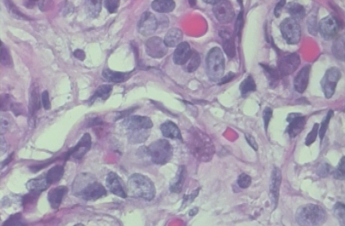
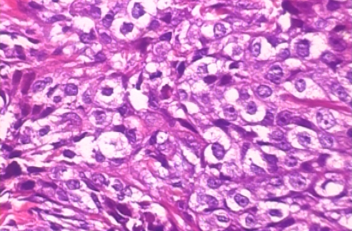

<h2 align = "center"> <b>Histopathological Image Classification using Convolutional Neural Network</b></h2> <h4 align = "right"> DSML@2020</h4>

##  <b>**Introduction** </b>

Cancer begins when healthy cells in the breast change and grow out of control, forming a mass or sheet of cells called a tumor. A tumor can be cancerous or benign. A cancerous tumor is malignant, meaning it can grow and spread to other parts of the body. A benign tumor means the tumor can grow but will not spread.<a href="https://www.cancer.net/cancer-types/breast-cancer/introduction#:~:text=Cancer%20begins%20when%20healthy%20cells,grow%20but%20will%20not%20spread."> (Source, [caner.net]) </a>
<table><tr>
<td>  </td>
<td>  </td>
</tr><caption><b>Histopathological Image</b></caption>
</table>

## **The problem statement**</b>

Identifying the presence or absence of benign or malignant tumors from `640 x 470px` from a digital histopathology images. One key challenge is that there exist varaiblity in size and shape of the nuclei and traditonal ML algorithms needs greater fine tuning of hand-crafted features. It's known now, as the amount of data increases traditional ML algorithms fails to capture all the detailing that hinders from incing closer to human accuracy.

In this lesson you will be classifying histopathological images using this <a href="https://web.inf.ufpr.br/vri/databases/breast-cancer-histopathological-database-breakhis/">BrekHis</a> dataset.
So, as part of the task you need to process this data by analyzing the images in the two categories and then creating a model that classifies these images into `benign` and `malignant`. 

You'll follow these steps:

<ol>
    
  <li> Explore the Example Data of benign and malignant Histopathological images</li>
  <li>Build a model</li>
    <ol>
        <li> Approach 1: Shallow Network
        <li> Approach 2: Convolutional Neural Network</li>
     </ol>
  <li>Training the above two approaches
  <li>Evaluating the model accuracy</li>
        
</ol>

<h2 align = "center"> <b>Histopathological Image Classification using fastai</b></h2> <h4 align = "right"> DSML@2021</h4>
##  <b>**Introduction** </b>
This dataset comes from Kather, Jakob Nikolas. (2019). Histological images for MSI vs. MSS classification in gastrointestinal cancer, FFPE samples [Data set]. Zenodo. http://doi.org/10.5281/zenodo.2530835

Much of the information in the description come either from the dataset description or the scientific article using it to predict MSI: Microsatellite instability determines whether patients with gastrointestinal cancer respond exceptionally well to immunotherapy. However, in clinical practice, not every patient is tested for MSI, because this requires additional genetic or immunohistochemical tests. This repository contains 192312 unique image patches derived from histological images of colorectal cancer and gastric cancer patients in the TCGA cohort (original whole slide SVS images are freely available at https://portal.gdc.cancer.gov/). All images in this repository are derived from formalin-fixed paraffin-embedded (FFPE) diagnostic slides ("DX" at the GDC data portal). This is explained well in this blog: http://www.andrewjanowczyk.com/download-tcga-digital-pathology-images-ffpe/

## **The problem statement**</b>

MSI: Microsatellite instability determines whether patients with gastrointestinal cancer respond exceptionally well to immunotherapy.

## **What's there..**</b>

<ol>
    
       <li>All SVS slides were preprocessed as follows</li>
<li>Automatic detection of tumor</li>

<li>Resizing to 224 px x 224 px at a resolution of 0.5 µm/px</li>

<li>Color normalization with the Macenko method (Macenko et al., 2009, http://wwwx.cs.unc.edu/~mn/sites/default/files/macenko2009.pdf)</li>

<li>Assignment of patients to either "MSS" (microsatellite stable) or "MSIMUT" (microsatellite instable or highly mutated)</li>

<li>Reformat the original images to JPG format (using bash command mogrify)</li>

## **Acknowledgements**</b>
Thanks to Jakob Nikolas Kather for the paper and the [github page] (https://github.com/jnkather/MSIfromHE)

